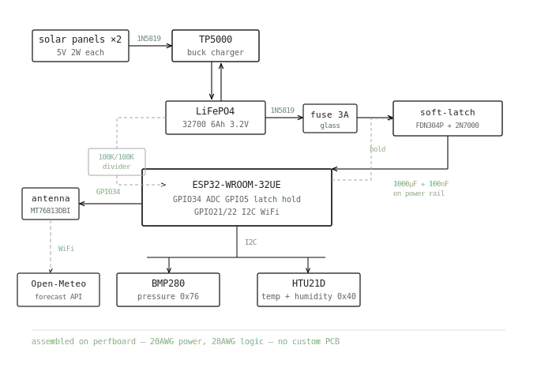

# MeteoNode
 
MeteoNode is a small solar-powered ESP32 weather node. The idea is to pull regional forecast data from Open-Meteo and adjust it using pressure, humidity, and temperature trends measured locally by the node itself. Instead of sending data somewhere else to process, the ESP32 handles everything on-device using a lightweight Bayesian-style system.
 
 
# Why
 
Regional forecasts are accurate at scale but they update slowly. Local pressure drops and humidity spikes can show incoming weather changes earlier than a regional model would catch. I wanted to see if those local trends could make a forecast feel more responsive at a specific location on a small standalone device.
 
Something like:
 
```
Open-Meteo rain chance: 40%
Pressure dropping fast
Humidity rising
 
=> local adjusted: 65%
```
 
It's not meant to replace anything. More of an experiment.
 
 
# How I built it
 
Most of the early time went into research and parts selection, not actual building.
 
My original sensor choice was the BME280 because it handles temperature, humidity, and pressure in one chip. While reading through datasheets and long-term testing threads I found that combined environmental sensors can slightly skew their own readings because of internal heat generation. So I split it into a BMP280 for pressure and an HTU21D for temperature and humidity. Separating them also made physical placement easier since they no longer needed to sit right next to each other.
 
The power system took the longest.
 
I initially looked at the TP4056 for charging but solar panels don't output stable voltage, they fluctuate constantly depending on sunlight and load. The TP4056 needs a stable input to work properly. I switched to the TP5000 because its buck converter handles variable input between 4.5V and 9V without needing anything extra to stabilize it.
 
For the battery I moved away from standard 18650 Li-ion. The node is meant to sit outside unattended in direct sun, and Li-ion can go into thermal runaway at high temperatures. LiFePO4 needs over 270°C to reach thermal runaway and doesn't sustain a fire even if it does ignite, so it was the obvious choice. I went with a Huaxing 32700 6000mAh solar grade cell.
 
Powering the ESP32 directly from the LiFePO4 cell also came with a problem I found during research. During WiFi transmission the ESP32 pulls sudden high current spikes that can drop the supply voltage and cause brownouts and random reboots, especially with solar-grade cells or long wiring. To fix that I added a 1000uF electrolytic capacitor for the transient demand and a 100nF ceramic for high-frequency RF decoupling.
 
The soft-latch circuit was probably the most interesting part. The node runs on a deep sleep cycle normally, but I also wanted a way for it to fully disconnect itself if the battery stays critically low for too long, to avoid deep discharge damage. The circuit uses an FDN304P P-channel MOSFET as the main switch and a 2N7000 N-channel to control it. The ESP32 holds the latch on after waking. If battery voltage drops below the cutoff the firmware pulls the latch low, the MOSFET opens, and power is cut completely. Manual restart needed after that.
 
One more thing the direct battery connection created was an ADC reference problem. Since the ESP32 runs off the cell directly there is no stable 3.3V reference, so the ADC reading drifts with battery voltage. The firmware handles this by reading the ESP32's internal 1.1V bandgap reference each wake cycle and using it to calculate the actual VREF before reading the battery.
 
 
# Enclosure
 
I wanted the enclosure done properly, not just a box you shove everything into.
 
The first decision was keeping the battery separate from the main electronics. The battery generates heat when charging, and heat near the sensors would throw off the readings, so the battery got its own compartment. I modeled it around the actual cell dimensions (32.2 x 70.5mm), added two side holes for the wires to pass through (a center hole would've conflicted with the pole clamp), and added tabs on both the box and lid for M3 bolts. There are grooves on the mating faces for O-rings to seal it.
 
The main electronics box went through a couple of iterations. I first made a single box, then split the interior into two sections: a sealed ESP32/power side and a vented sensor side. I live in a part of Assam where humidity sits between 80 and 90 percent most of the year and hits 100 during monsoon. The ESP side is fully sealed with an O-ring groove on the lid. The sensor side has ventilation holes so the HTU21D is actually reading ambient air, not trapped air. I added rails inside both sides to mount the sensors and perfboard without floating them around loose.
 
For mounting I took inspiration from motor shaft couplers. I made a pipe-shaped clamp that slides over the main pole with set screws, and bolted the electronics box to that. The whole thing sits on a 2-meter pole with a rectangular channel running through it for the battery wires.
 
Since I couldn't find the O-rings I needed, I ended up making gaskets instead and finished the assembly.
 
CAD files are in `Hardware/Cad files/` as STEP files. There's a full assembly plus individual parts: battery box, main electronics box, pole mount bracket, and pole.
 
 
# Hardware
 
| Component | Purpose |
|---|---|
| ESP32-WROOM-32UE Dev Board | Main controller |
| BMP280 | Pressure sensor |
| HTU21D | Temperature and humidity sensor |
| TP5000 Charge Module | LiFePO4 solar charging |
| Huaxing 32700 6000mAh LiFePO4 | Power storage |
| 2W 5V Solar Panel ×2 | Solar input |
| FDN304P P-Channel MOSFET | High-side power switch |
| 2N7000 N-Channel MOSFET | Soft-latch control |
| 1000uF Electrolytic Capacitor | WiFi current spike stabilization |
| 100nF Ceramic Capacitor | RF decoupling |
| 1N5819 Schottky Diode | Reverse current protection |
| 3A Glass Fuse + Holder | Overcurrent protection |
| MT76813DBI WiFi Antenna | External antenna |
| 100K Resistor | Voltage divider + PMOS gate pull-up |
| 10K Resistor | NMOS gate pull-down |
| 1K Resistor | ESP32 overcurrent protection |
 
Everything is from ElectronicsComp.
 
 
# Block diagram
 

 
 
# Firmware
 
Each wake cycle the ESP32 reads the sensors, fetches a forecast from Open-Meteo, adjusts the rain probability using local trends from RTC memory, and goes back to sleep. RTC memory keeps the last 4 readings alive across deep sleep so the trend analysis always has something to work with.
 
Full setup and wiring details are in `Firmware/README.md`.
